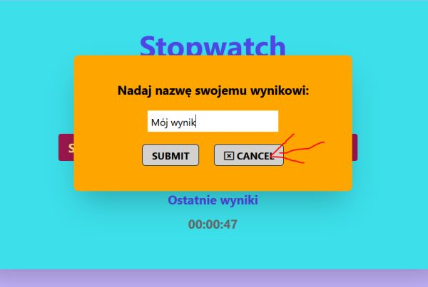

## StopWatch Bug Report

These are the issues I encountered when adding functionality to the stopwatch and was not able to fix them for now:

1. When the input element is filled in but the cancel button is pressed to hide the modal, the data anyway gets saved to the local storage.

 

2. The accordion feature does not work fully. When the result notes are added, only every other element has a properly working accordion (the others have this feature disabled).

3. The saved results notes, displayed as accordion, do not stay on the webpage when refreshing it despite still having this data in local storage.

4. When saving a single time result from the main timer display into local storage (without adding new times upon pressing the next button), it gets saved as an empty array.